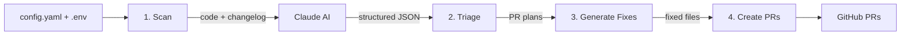

# viam-module-insights

Automated scan-triage-fix-PR pipeline for Viam module repositories. Uses Claude AI to analyze source code against the Viam SDK changelog, identify breaking changes and deprecated APIs, then generate and open fix PRs automatically.

## How It Works



The pipeline runs in 4 phases:

| Phase | What it does |
|-------|-------------|
| **Scan** | Recursively reads source files from the target repo via GitHub API, fetches the Viam SDK changelog, and sends both to Claude for analysis. Results are cached to `scan_<repo>.json`. |
| **Triage** | Groups scan findings into discrete PR plans by concern (e.g., SDK version bump, deprecated API migration). |
| **Generate Fixes** | For each PR plan, fetches the current file content and asks Claude to produce fixed versions. |
| **Create PRs** | Creates a branch, commits the fixed files, and opens a pull request on GitHub. |

## Setup

### Prerequisites
- Python 3.11+
- GitHub personal access token (with repo scope)
- Anthropic API key

### Install

```bash
git clone <repo-url>
cd viam-module-insights
python -m venv venv
source venv/bin/activate
pip install -r requirements.txt
```

### Configure

1. Copy the example config and edit it with your GitHub username/org and target repos:

```bash
cp config.yaml.example config.yaml
```

Edit `config.yaml`:
```yaml
github:
  org: "your-github-username"   # GitHub user or org that owns the target repos
  token_env: "GITHUB_TOKEN"

anthropic:
  api_key_env: "ANTHROPIC_API_KEY"
  model: "claude-sonnet-4-20250514"
  max_tokens: 8000

target_repos:
  - "my-module-repo"
  - "another-module"
```

2. Create a `.env` file with your secrets:

```
GITHUB_TOKEN=your-github-token
ANTHROPIC_API_KEY=your-anthropic-key
```

## Usage

```bash
# Full pipeline: scan → triage → generate fixes → create PRs
python main.py <repo-name>

# Scan only — analyze the repo and print the health report (no PRs created)
python main.py <repo-name> --scan-only

# Dry run — scan + triage to preview PR plans (no fixes generated, no PRs created)
python main.py <repo-name> --dry-run
```

The `<repo-name>` must be a repo listed in `config.yaml` under `target_repos`, owned by the `github.org` user/org.

### Example

```bash
# Preview the scan results for a repo
python main.py camera-zone --scan-only

# See what PRs would be created without actually creating them
python main.py camera-zone --dry-run

# Run the full pipeline — creates branches and opens PRs
python main.py camera-zone
```

## Project Structure

```
main.py                         # CLI entry point — runs the 4-phase pipeline
src/
  config.py                     # Config loader (config.yaml + .env)
  clients/
    github_client.py            # GitHub API wrapper (PyGithub) — read files, create branches/PRs
    claude_client.py            # Anthropic Claude API wrapper — analysis + code fix generation
    changelog_fetcher.py        # Fetches Viam changelog, extracts breaking changes
  analyzers/
    code_scanner.py             # Recursively reads source files from a GitHub repo
    scan_analyzer.py            # Orchestrates code scan + changelog + Claude analysis
    file_finder.py              # Locates dependency/config files via GitHub API
    module_analyzer.py          # Legacy single-module health analysis
  pr_engine/
    triager.py                  # Groups scan findings into PR plans by concern
    fix_generator.py            # Uses Claude to produce fixed file contents
    pr_creator.py               # Creates branches, commits fixes, opens PRs on GitHub
  reporters/                    # TODO: report formatting and output
tests/
  test_code_scanner.py          # Code scanner tests
  test_scan_analyzer.py         # Scan analyzer tests
  test_changelog_fetcher.py     # Changelog fetcher tests
  test_pr_pipeline.py           # PR pipeline tests
  test_module_analyzer.py       # Legacy module analyzer tests
config.yaml.example             # Template config (copy to config.yaml)
.env.example                    # Template secrets (copy to .env)
```

## TODO

### Stage 1: Weekly Health Checks

- [x] Config system — YAML config + `.env` for secrets
- [x] GitHub API client — fetch repos, list files, create branches/PRs
- [x] Code scanner — recursive source file reader via GitHub API
- [x] Changelog fetcher — fetch Viam changelog, extract breaking changes
- [x] Claude client — code analysis + fix generation
- [x] Scan analyzer — orchestrate code scan + changelog + Claude analysis
- [x] PR triager — group scan findings into PR plans by concern
- [x] Fix generator — Claude-powered code fix production
- [x] PR creator — branch creation, file commits, PR opening
- [x] CLI entry point — `python main.py <repo>` with `--scan-only` and `--dry-run`
- [ ] Batch runner — loop all `config.target_repos`, not just one
- [ ] Parallel execution — async/concurrent module analysis
- [ ] Reports written to `./reports/` directory
- [ ] Reporters module — formatting, filtering, dashboard export
- [ ] GitHub Actions workflow — weekly cron trigger
- [ ] Error handling — retries, rate limits, graceful degradation

### Stage 2: SDK Change Orchestrator

- [ ] Trigger on SDK version bumps or large pushes
- [ ] Diff analysis — compare SDK changes to module code
- [ ] Affected module identification (e.g., `get_images` change targets camera modules)
- [ ] Complexity-based prioritization (easiest changes first)
- [ ] Feedback loop — unmerged PRs flagged as stale
